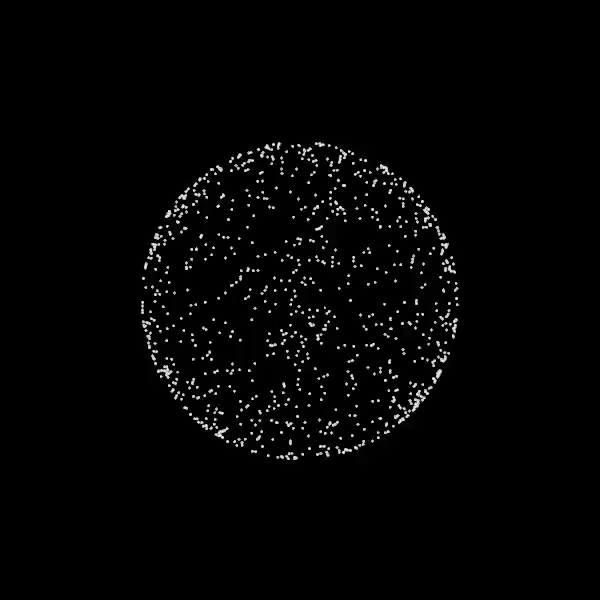

# A Collections of visualizations done by me

## Avoidants:
A collection of lines avoiding each other.

Example:

## Spheres:
Spheres along a sphere being attracted to random points on the sphere, using Newton's general law of gravitation

Example:

