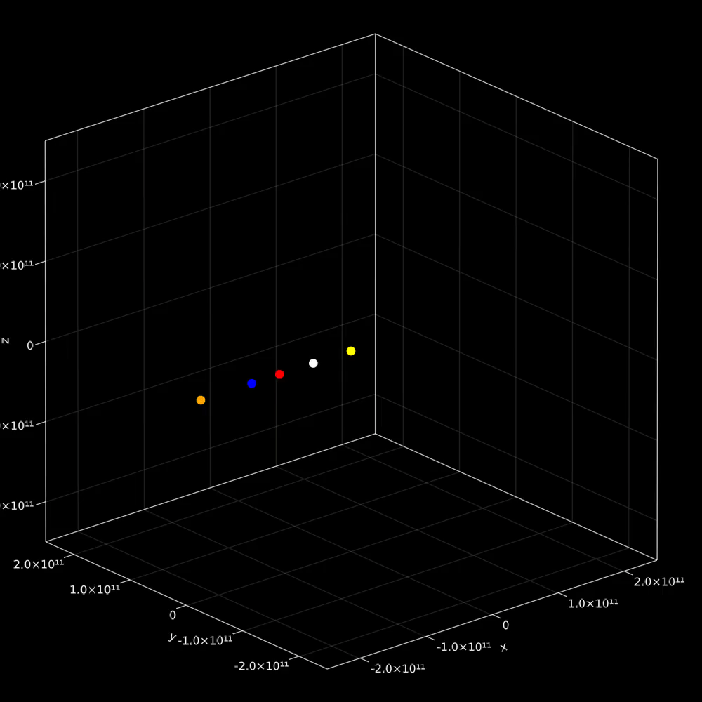

# A Collections of visualizations done by me

## Fluid Dynamics:
A simple fluid simulation based on simplified forms of the Navier Stokes equations
Example, density starting in a horizontal line with a vector field for velocities around the center of the scene (Density on the left, vector field on the right):

## Avoidants:
A collection of lines avoiding each other.

Example:

## Spheres:
Spheres along a sphere being attracted to random points on the sphere, using Newton's general law of gravitation

Example:

## Galaxies
Simulations of planets / galaxies. Work in progress.

Example:

